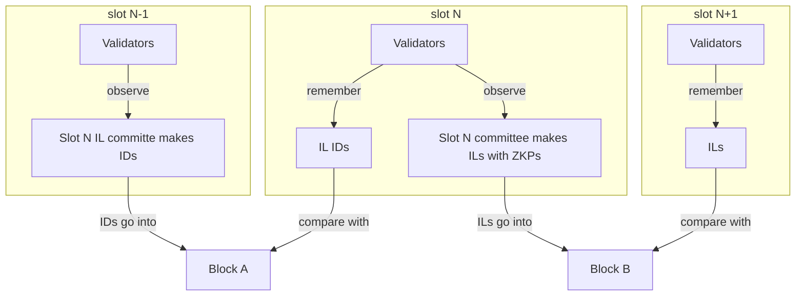

# FOCILIS
FOCIL with Indistinguishable Submissions

### Overview

Fork-choice enforced Inclusion Lists (FOCIL) is extended to have IL members produce proofs that they are committee members, rather than signing ILs with their validator key. To prevent multiple
ILs per member, members publish an IL ID in the preceding slot. The IDs are used as nullifiers. The IDs are registered in the preceding block using the same fork choice rule that FOCIL uses.

See FOCIL: https://eips.ethereum.org/EIPS/eip-7805

### Motivation

This is an extension to the Fork-choice enforced Inclusion Lists (FOCIL) protocol.
The purpose of the system is to neutrally include valid transactions. In Ethereum today, neutrality depends on an honest declaration by the sole block producer about which transactions they saw. In FOCIL, neutrality depends on an honest declaration by at least 1 of 16 members. In both systems, declarations link individual validators to specific transactions.

In FOCILIS, declarations occur at the group level. The IL committee in aggregate produces a set of observed transactions. The individual members act independently and their view of the mempool is not attributable to any one member.

|System|Honesty assumption|Person responsible for tx inclusion|
|-|-|-|
|Ethereum|1 of 1|Block producer|
|Ethereum FOCIL|1 of 16|A specific committee member|
|Ethereum FOCILIS|1 of 16|Any 1 of 16 committee members|

FOCILIS works as follows. IL members sign attach a zero knowledge proof with their IL. This proves it was signed by some IL member, but not which one.

The system has two stages. IL members first publish an ID, then in the next slot use that ID to publish the IL.

The plain FOCIL protocol modifies the fork choice algorithm to include a rule where attesters compare local ILs with the ILs in a block.

The FOCILIS extension retains that fork choice change and adds a second rule with the same mechanics. Attesters compare local IL IDs with the IL IDs in a block.

### Protocol

In FOCILIS, IL members announce an ID they will use when they make their IL.
They create a ZK proof of their IL using that ID.
The ZK proof protects their identity and the ID prevents a member from making two ILs. ID registration becomes part of the fork choice much like the IL rule in plain FOCIL.

For an IL committee for slot `n`

Plain FOCIL
|FOCIL|slot n|block B|slot n + 1|
|-|-|-|-|
|ILs|published||voted on|
|Block||released with ILs|

FOCILIS
|FOCILIS|slot n - 1|block A|slot n|block B|slot n + 1|
|-|-|-|-|-|-|
|IL IDs|published||voted on||
|ILs|||published using IDs||voted on|
|Block||released with IL IDs||released with ILs||

FOCIL Fork choice extended to include votes on IL IDs published in slot `n - 1`.
A block producer who ignores IL IDs that attesters saw will not get votes.
Fork choice extended (plain FOCIL) to include votes on ILs published in slot `n`.
A block producer who ignores ILs that attesters saw will not get votes.

So, attesters looking at a single block have two items to check:
- Does the block contain IL IDs that match the local view (to be used in the next block)?
- Does the block contain ILs that match the local view, and the associated transactions?

For the production of a block for slot `n` using ILs the steps are:
- slot `n - 2` IL member creates an ID commitment `hash[randomness | external nullifier | pubk]` and publishes to validators
- validators record and pass on one ID per IL member. IDs are frozen at 9s.
- block producer includes `n - 2` is produced, containing IL IDs
- Attesters vote on blocks that contain the all the IL IDs they saw.
- slot `n - 1` IL member creates IL and a ZK proof using their ID. This reveals the external nullifier.
- validators check the ZK proof and check that the ID has not been used before. They record and pass on the proof and ID.
- block producer makes block for slot `n - 1`

An IL member who is offline during ID registration is unable to participate. The ID list and IL list will be shorter and there is no negative impact on block production.

||FOCIL|FOCILIS|
|-|-|-|
|Plausible deniability|No|Yes|
|Honesty assumption|1-of-n|1-of-n|
|Message size|8kb|8kb + ~100byte proof|
|Committee compute burden|Sign list|Sign list + ZK-proof sig is in committee|
|Validator compute burden|Check sigs|Check IL ZK proofs. Check IL ID registration (for next slot) ZK proofs |
|Builder compute burden|Check sigs. Append TXs from IL to block if valid |Same as validator. Append TXs from IL to block if valid. Append IL ID registrations (for next slot) to block. |

### Proofs

The exact proof system is open for suggestions.

A suitable proof system likely has the following properties:
- Proof kind: Membership proof subprotocol
- Algorithm: SNARK
- Structure: Merkle based with 16 members
- Hash function: Poseidon
- Validator credentials: BLS12-381
- Trusted setup: N/A

Steps:
- 16 validators are announced as IL members.
- Members each generate IDs: `hash[randomness | external nullifier | pubk]`
- Validators distribute IDs.
- A builder publishes merkle trie with 16 IDs as part of the block
- Members each construct IL as list of Tx Hashes and hash that list.
- Members each generate proof revealing `external nullifier` and committing to one ID in the IDs trie and to the IL-hash.
- Validators verify the ILs and IL proofs and distribute them
- A builder publishes the ILs as part of the block.

### Benchmarks

The semaphore system is used as a benchmark for approximation.
Proofs for FOCILIS have 16 members.

- Proof generation with 1 member: 169ms
- Proof generation with 100 members: 255ms
- Proof verification with 100 members: 9.5ms

https://docs.semaphore.pse.dev/benchmarks

## Future considerations

### Recursion in a SNARKed consensus

In the event that the consensus fork choice rule is SNARKified such as in a beam chain upgrade, the presence of ILs being check by SNARKs implies recursion. The consensus SNARK must verify the IL SNARKs. So, any SNARK chosen for the ILs must be made with this in mind (be recursion-friendly), so as to not make the consensus SNARK proving time too slow.

## Security

### Quantum safety

Protocols that use deterministic nullifiers may be vulnerable in post-quantum setting. The protocol is interactive, which allows for nondeterministic nullifiers and avoids this attack vector that would link IL IDs back to validator public keys.

### Fork choice stability

Long reorgs in which the builder has not retained the IL IDs or the ILs. Their block will not be voted on by the builder. However, just like in FOCIL an RPC endpoint could be added to request missing IL IDs (by IL committee index) or ILs (by sending a list of IL-hashes they have and asking for ones not in the list) from peers at=10s.

### Validator computational burden

The 16 IL committee members must be able to compute a zero knowledge proof within 9 seconds. If they fail to do so the IL list is frozen and their contribution will not be included. This does not halt block production. Estimated time is ~200ms, which is well within 9s.

The validators must be able to verify 16 zero knowledge proofs within 3 seconds. If they fail to do so, the ILs may not be distributed evenly across the validator set. This may increase number of heads being voted on at the tip, slowing consensus formation. Estimated time is ~10ms * 16 = 160ms, which is below the 3 seconds.

### Validator bandwidth

Validators must gossip 16 * 8kb lists with plain FOCIL. Larger messages impair the ability for lists to propagate. With FOCILIS the 8kb lists have an additional estimated ~100bytes, which is an insignificant increase.

### Vote buying

Committee members contribute ILs voluntarily and with no reward. However, an IL represents a valuable good (guaranteed transaction inclusion). An actor can pay an IL committee member to put a transaction in their IL. Upon block production,
payment to the IL member can be released, or otherwise lose a bond held in a smart contract. This can be thought of as a kind of preconfirmation mechanism. As such, a marketplace for preconfirmations could arise
where IL members compete for the opportunity.

This applies to FOCIL and FOCILIS. In plain FOCIL, the IL signatures can be used. In FOCILIs, the IL member could reveal their secret input, showing which IL they submitted at the expense of losing this privacy.

If needed, the semaphore component of FOCILIS could be replaced with a MACI-like (minimal anti-collusion infrastructure) construction which prevents vote buying through the absence of receipts. This may be beneficial in the two following scenarios:
- FOCIL: The IL-preconf marketplace may completely displace the priority fee market from the builder to the IL committee, causing increased complexity or destabilisation to an existing stable MEV market dynamic.
- FOCILIS: The IL-preconf marketplace exists and is used by most of the IL committee, effectively making ILs attributable again.

## Reading

https://blog.aayushg.com/nullifier/

https://ethresear.ch/t/proof-of-validator-a-simple-anonymous-credential-scheme-for-ethereums-dht/16454

https://docs.semaphore.pse.dev/

https://docs.zkproof.org/pages/standards/accepted-workshop3/proposal-semaphore.pdf

https://medium.com/coinmonks/to-mixers-and-beyond-presenting-semaphore-a-privacy-gadget-built-on-ethereum-4c8b00857c9b